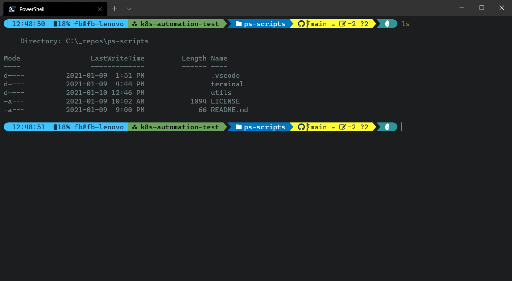

# Windows Terminal configuration



## Prerequisites

- [Windows Terminal](https://www.microsoft.com/en-us/p/windows-terminal/9n0dx20hk701)
- [PowerShell 7](https://docs.microsoft.com/en-us/powershell/scripting/install/installing-powershell?view=powershell-7.1)


## Installation

1. Install modules for `posh-git` and `oh-my-posh`

```PowerShell
Install-Module posh-git -Scope CurrentUser
Install-Module oh-my-posh -Scope CurrentUser
```

2. Update PowerShell profile

```PowerShell
Import-Module posh-git
Import-Module oh-my-posh
Set-Prompt
Set-Theme Paradox
```

More about [PowerShell profile locations](https://docs.microsoft.com/en-us/powershell/module/microsoft.powershell.core/about/about_profiles?view=powershell-7.1#the-profile-files).


## Additional oh-my-posh configuration

`oh-my-posh` v3 configuration can be extended with specifying additional [segments](https://ohmyposh.dev/docs/). Pre-defined segments can also be altered.

For example, the battery segment of my configuration looks like this:

```json
{
    "type": "battery",
    "style": "powerline",
    "invert_powerline": false,
    "foreground": "#193549",
    "background": "#40c4ff",
    "leading_diamond": "",
    "trailing_diamond": "",
    "properties": {
        "battery_icon": "",
        "charged_color": "",
        "charging_color": "",
        "color_background": true,
        "discharging_color": "",
        "postfix": "%"
    }
},
```

How to update `oh-my-posh` module:

```PowerShell
Update-Module -Name oh-my-posh -AllowPrerelease -Scope CurrentUser
```

Default configuration directory for `oh-my-posh` v3:

```
C:\Users\<userName>\Documents\PowerShell\Modules\oh-my-posh\3.68.5
```